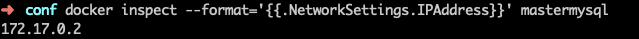

docker安装mysql搭建主从
---
# 查看镜像
docker search mysql:5.7
# 拉取镜像
docker pull mysql:5.7
# 运行mysql容器

### 建立配置文件

#### master配置文件
vim master/conf/my.cnf
```
[mysqld]
server_id = 1
log-bin= mysql-bin
read-only=0
replicate-ignore-db=mysql
replicate-ignore-db=sys
replicate-ignore-db=information_schema
replicate-ignore-db=performance_schema
```
#### slave配置文件
vim slave/conf/my.cnf
```
[mysqld]
server_id = 2
log-bin= mysql-bin
log_slave_updates=1
read-only=1
replicate-ignore-db=mysql
replicate-ignore-db=sys
replicate-ignore-db=information_schema
replicate-ignore-db=performance_schema
```
> 注：从库还需要添加一个参数：log-slave-updates，log-slave-updates参数默认是关闭的状态，如果不手动设置，那么bin-log只会记录直接在主库上执行的SQL语句，由replication机制的SQL线程读取relay-log而执行的SQL语句并不会记录到bin-log，那么就无法实现从库binlog的实时同步。


### 运行mysql-master
docker run --name mastermysql \
-p 3307:3306 \
-e MYSQL_ROOT_PASSWORD=123456 \
-v ~/opt/docker/mysql/master/data:/var/lib/mysql \
-v ~/opt/docker/mysql/master/conf/my.cnf:/etc/mysql/my.cnf \
-d mysql:5.7

### 运行mysql-salve
docker run --name slavemysql \
-p 3308:3306 \
-e MYSQL_ROOT_PASSWORD=123456 \
-v ~/opt/docker/mysql/slave/data:/var/lib/mysql \
-v ~/opt/docker/mysql/slave/conf/my.cnf:/etc/mysql/my.cnf \
-d mysql:5.7


# 查看docker镜像运行情况
docker ps


# 进入master容器
docker exec -it mastermysql bash

# 进入mysql
root@a77371ae40bd:/# mysql -uroot -p123456

# 查看master状态
mysql> show master status;


# 创建binlog用户，授权
### 创建binlog用户密码为binlog
CREATE USER 'binlog'@'%' IDENTIFIED BY 'binlog';
### 授权binlog用户拥有binlog库所有表的所有权限
GRANT ALL ON binlog.* TO 'binlog'@'%';
### 授予用户 binlog REPLICATION SLAVE 权限和 REPLICATION CLIENT 权限，用于在主从库之间同步数据。
GRANT REPLICATION SLAVE, REPLICATION CLIENT ON \*.\* TO 'binlog'@'%';

# 进入salve容器
docker exec -it slavemysql bash

# 在Slave中进入mysql，执行:
CHANGE MASTER TO master_host = '172.17.0.2', \
master_user = 'binlog', \
master_password = 'binlog', \
master_port = 3306, \
master_log_file = 'mysql-bin.000003', \
master_log_pos = 154, \
master_connect_retry = 30;

**注：**
>master_host ：Master 的地址，指的是容器的独立ip, 可以通过下面命令查询：

>docker inspect --format='{{.NetworkSettings.IPAddress}}' 容器名称 | 容器id



>master_port：Master 的端口号，指的是容器的端口号

>master_user：用于数据同步的用户

>master_password：用于同步的用户的密码

>master_log_file：指定 Slave 从哪个日志文件开始复制数据，即上文中提到的 File 字段的值（主库记录的值）

>master_log_pos：从哪个 Position 开始读，即上文中提到的 Position 字段的值（主库的pos值）

>master_connect_retry：如果连接失败，重试的时间间隔，单位是秒，默认是 60 秒

# 查询主从同步状态:
show slave status \G;


# 开启主从复制过程
start slave;

再次查询主从同步状态 show slave status \G;


# 在master库新建binlog库 mlsql_binlog表进行同步测试：
create database binlog;

use binlog;

CREATE TABLE `mlsql_binlog` ( \
  `id` int(11) unsigned NOT NULL AUTO_INCREMENT, \
  `log` varchar(200) DEFAULT NULL, \
  PRIMARY KEY (`id`) \
) CHARSET=utf8;

insert into `mlsql_binlog` (`id`, `log`) values(1, 'hello');

> 友情链接：https://learnku.com/articles/30439
